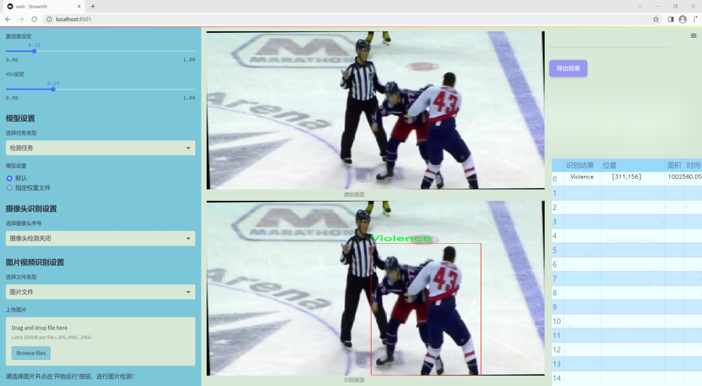
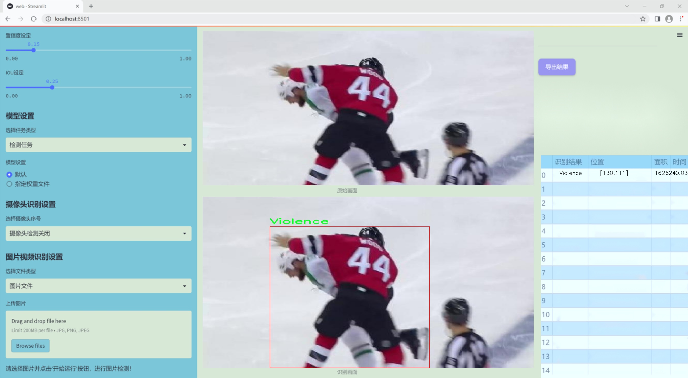
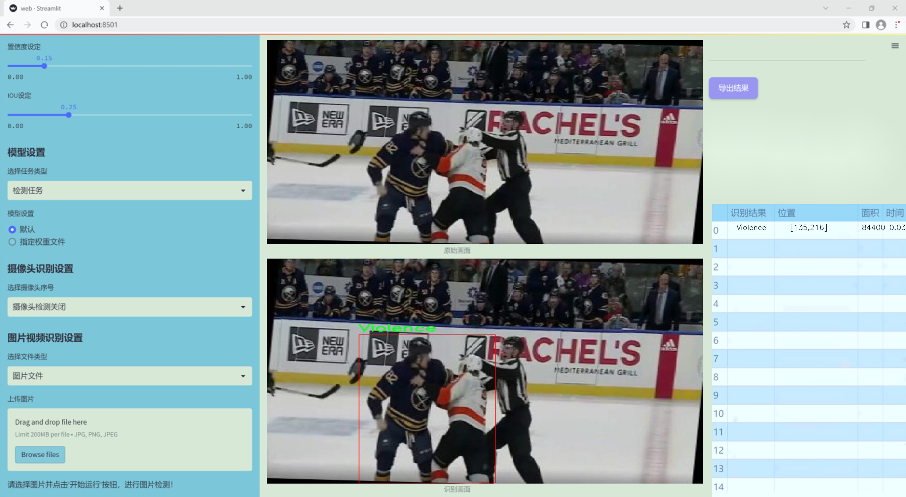
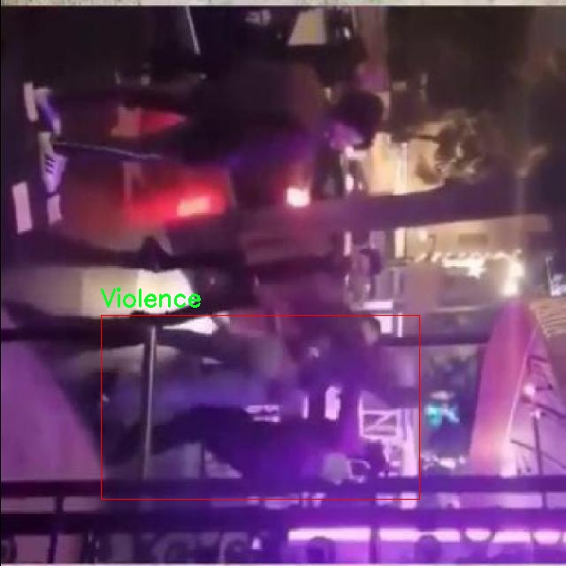

### 1.背景意义

研究背景与意义

随着社会的快速发展，暴力行为的频发已成为全球范围内亟待解决的社会问题。打架斗殴等暴力行为不仅对个人的身心健康造成了严重影响，也对社会的安全稳定构成了威胁。因此，如何有效地监测和识别这些暴力行为，成为了计算机视觉领域的重要研究方向之一。近年来，深度学习技术的迅猛发展为暴力行为检测提供了新的解决方案，尤其是基于YOLO（You Only Look Once）系列的目标检测算法，因其高效性和实时性而受到广泛关注。

本研究旨在基于改进的YOLOv11算法，构建一个高效的打架斗殴暴力行为检测系统。该系统的核心在于利用先进的计算机视觉技术，实时分析视频监控画面中的暴力行为，从而为公共安全提供有效的技术支持。为了实现这一目标，我们采用了一个专门针对暴力行为的数据集，该数据集包含4295张经过精确标注的图像，所有图像均以YOLOv8格式进行注释，确保了数据的准确性和可用性。

通过对数据集的深入分析，我们发现其涵盖了丰富的暴力行为场景，且经过了一系列的预处理和增强技术处理，能够有效提升模型的泛化能力和鲁棒性。研究中，我们将对YOLOv11算法进行改进，以提高其在复杂环境下的检测精度和速度。这不仅有助于提升暴力行为检测的准确性，也为相关领域的研究提供了新的思路和方法。

综上所述，基于改进YOLOv11的打架斗殴暴力行为检测系统的研究，不仅具有重要的理论意义，还有助于推动智能监控技术的发展，为社会的安全管理提供有力的技术保障。

### 2.视频效果

[2.1 视频效果](https://www.bilibili.com/video/BV1VMSMY5EaJ/)

### 3.图片效果







##### [项目涉及的源码数据来源链接](https://kdocs.cn/l/cszuIiCKVNis)**

注意：本项目提供训练的数据集和训练教程,由于版本持续更新,暂不提供权重文件（best.pt）,请按照6.训练教程进行训练后实现上图演示的效果。

### 4.数据集信息

##### 4.1 本项目数据集类别数＆类别名

nc: 1
names: ['Violence']


该项目为【目标检测】数据集，请在【训练教程和Web端加载模型教程（第三步）】这一步的时候按照【目标检测】部分的教程来训练

##### 4.2 本项目数据集信息介绍

本项目数据集信息介绍

本项目旨在改进YOLOv11模型，以实现高效的打架斗殴暴力行为检测系统。为此，我们构建了一个专门针对暴力行为检测的数据集。该数据集的主题围绕“violence detection”，旨在为模型提供丰富的训练样本，以提高其在真实场景中的识别能力。数据集中包含的类别数量为1，具体类别为“Violence”，这意味着我们将重点关注暴力行为的识别，而不涉及其他类型的行为。这一单一类别的设定有助于模型在特定任务上的精准训练，确保其能够在复杂的环境中有效地识别和区分暴力行为。

在数据集的构建过程中，我们收集了大量与暴力行为相关的视频和图像素材，这些素材涵盖了多种场景和情境，包括街头打斗、家庭争吵以及其他形式的暴力冲突。为了保证数据的多样性和代表性，我们从不同的来源获取了数据，确保样本在时间、地点和参与者等方面的多样性。这种多样性不仅增强了模型的泛化能力，也使其在面对不同类型的暴力行为时能够保持较高的准确率。

此外，为了提高数据集的标注质量，我们采用了严格的标注流程，确保每一帧图像或视频片段都经过专业人员的仔细审核和标注。这一过程不仅提高了数据集的可靠性，也为后续的模型训练提供了坚实的基础。通过这种方式，我们期望构建一个高质量的数据集，以支持YOLOv11模型在暴力行为检测任务中的应用，从而为公共安全和社会治理提供有力的技术支持。





### 5.全套项目环境部署视频教程（零基础手把手教学）

[5.1 所需软件PyCharm和Anaconda安装教程（第一步）](https://www.bilibili.com/video/BV1BoC1YCEKi/?spm_id_from=333.999.0.0&vd_source=bc9aec86d164b67a7004b996143742dc)


[5.2 安装Python虚拟环境创建和依赖库安装视频教程（第二步）](https://www.bilibili.com/video/BV1ZoC1YCEBw?spm_id_from=333.788.videopod.sections&vd_source=bc9aec86d164b67a7004b996143742dc)

### 6.改进YOLOv11训练教程和Web_UI前端加载模型教程（零基础手把手教学）

[6.1 改进YOLOv11训练教程和Web_UI前端加载模型教程（第三步）](https://www.bilibili.com/video/BV1BoC1YCEhR?spm_id_from=333.788.videopod.sections&vd_source=bc9aec86d164b67a7004b996143742dc)


按照上面的训练视频教程链接加载项目提供的数据集，运行train.py即可开始训练



     Epoch   gpu_mem       box       obj       cls    labels  img_size
     1/200     20.8G   0.01576   0.01955  0.007536        22      1280: 100%|██████████| 849/849 [14:42<00:00,  1.04s/it]
               Class     Images     Labels          P          R     mAP@.5 mAP@.5:.95: 100%|██████████| 213/213 [01:14<00:00,  2.87it/s]
                 all       3395      17314      0.994      0.957      0.0957      0.0843

     Epoch   gpu_mem       box       obj       cls    labels  img_size
     2/200     20.8G   0.01578   0.01923  0.007006        22      1280: 100%|██████████| 849/849 [14:44<00:00,  1.04s/it]
               Class     Images     Labels          P          R     mAP@.5 mAP@.5:.95: 100%|██████████| 213/213 [01:12<00:00,  2.95it/s]
                 all       3395      17314      0.996      0.956      0.0957      0.0845

     Epoch   gpu_mem       box       obj       cls    labels  img_size
     3/200     20.8G   0.01561    0.0191  0.006895        27      1280: 100%|██████████| 849/849 [10:56<00:00,  1.29it/s]
               Class     Images     Labels          P          R     mAP@.5 mAP@.5:.95: 100%|███████   | 187/213 [00:52<00:00,  4.04it/s]
                 all       3395      17314      0.996      0.957      0.0957      0.0845


###### [项目数据集下载链接](https://kdocs.cn/l/cszuIiCKVNis)

### 7.原始YOLOv11算法讲解


###### YOLOv11改进方向

与YOLOv 10相比，YOLOv 11有了巨大的改进，包括但不限于：

  * 增强的模型结构：模型具有改进的模型结构，以获取图像处理并形成预测
  * GPU优化：这是现代ML模型的反映，GPU训练ML模型在速度和准确性上都更好。
  * 速度：YOLOv 11模型现在经过增强和GPU优化以用于训练。通过优化，这些模型比它们的前版本快得多。在速度上达到了25%的延迟减少！
  * 更少的参数：更少的参数允许更快的模型，但v11的准确性不受影响
  * 更具适应性：更多支持的任务YOLOv 11支持多种类型的任务、多种类型的对象和多种类型的图像。

###### YOLOv11功能介绍

Glenn Jocher和他的团队制作了一个令人敬畏的YOLOv 11迭代，并且在图像人工智能的各个方面都提供了YOLO。YOLOv 11有多种型号，包括：

  * 对象检测-在训练时检测图像中的对象
  * 图像分割-超越对象检测，分割出图像中的对象
  * 姿态检测-当用点和线训练时绘制一个人的姿势
  * 定向检测（OBB）：类似于对象检测，但包围盒可以旋转
  * 图像分类-在训练时对图像进行分类

使用Ultralytics Library，这些模型还可以进行优化，以：

  * 跟踪-可以跟踪对象的路径
  * 易于导出-库可以以不同的格式和目的导出
  * 多场景-您可以针对不同的对象和图像训练模型

此外，Ultralytics还推出了YOLOv 11的企业模型，该模型将于10月31日发布。这将与开源的YOLOv
11模型并行，但将拥有更大的专有Ultralytics数据集。YOLOv 11是“建立在过去的成功”的其他版本的之上。

###### YOLOv11模型介绍

YOLOv 11附带了边界框模型（无后缀），实例分割（-seg），姿态估计（-pose），定向边界框（-obb）和分类（-cls）。

这些也有不同的尺寸：纳米（n），小（s），中（m），大（l），超大（x）。


YOLOv11模型

###### YOLOv11与前版本对比

与YOLOv10和YOLOv8相比，YOLOv11在Ultralytics的任何帖子中都没有直接提到。所以我会收集所有的数据来比较它们。感谢Ultralytics：

**检测：**


YOLOv11检测统计


YOLOv10检测统计

其中，Nano的mAPval在v11上为39.5，v10上为38.5；Small为47.0 vs 46.3，Medium为51.5 vs
51.1，Large为53.4 vs 53.2，Extra Large为54.7vs
54.4。现在，这可能看起来像是一种增量增加，但小小数的增加可能会对ML模型产生很大影响。总体而言，YOLOv11以0.3
mAPval的优势追平或击败YOLOv10。

现在，我们必须看看速度。在延迟方面，Nano在v11上为1.55 , v10上为1.84，Small为2.46 v2.49，Medium为4.70
v4.74，Large为6.16 v7.28，Extra Large为11.31
v10.70。延迟越低越好。YOLOv11提供了一个非常低的延迟相比，除了特大做得相当差的前身。

总的来说，Nano模型是令人振奋的，速度更快，性能相当。Extra Large在性能上有很好的提升，但它的延迟非常糟糕。

**分割：**


YOLOV11 分割统计


YOLOV9 分割统计


YOLOV8 分割数据

总体而言，YOLOv 11上的分割模型在大型和超大型模型方面比上一代YOLOv 8和YOLOv 9做得更好。

YOLOv 9 Segmentation没有提供任何关于延迟的统计数据。比较YOLOv 11延迟和YOLOv 8延迟，发现YOLOv 11比YOLOv
8快得多。YOLOv 11将大量GPU集成到他们的模型中，因此期望他们的模型甚至比CPU测试的基准更快！

姿态估计：


YOLOV11姿态估计统计


YOLOV8姿态估计统计

YOLOv 11的mAP 50 -95统计量也逐渐优于先前的YOLOv 8（除大型外）。然而，在速度方面，YOLOv
11姿势可以最大限度地减少延迟。其中一些延迟指标是版本的1/4！通过对这些模型进行GPU训练优化，我可以看到指标比显示的要好得多。

**定向边界框：**


YOLOv11 OBB统计


YOLOv8 OBB统计

OBB统计数据在mAP
50上并不是很好，只有非常小的改进，在某种程度上小于检测中的微小改进。然而，从v8到v11的速度减半，这表明YOLOv11在速度上做了很多努力。

**最后，分类：**


YOLOv 11 CLS统计


YOLOv8 CLS统计

从v8到v11，准确性也有了微小的提高。然而，速度大幅上升，CPU速度更快的型号。


### 8.200+种全套改进YOLOV11创新点原理讲解

#### 8.1 200+种全套改进YOLOV11创新点原理讲解大全

由于篇幅限制，每个创新点的具体原理讲解就不全部展开，具体见下列网址中的改进模块对应项目的技术原理博客网址【Blog】（创新点均为模块化搭建，原理适配YOLOv5~YOLOv11等各种版本）

[改进模块技术原理博客【Blog】网址链接](https://gitee.com/qunmasj/good)


#### 8.2 精选部分改进YOLOV11创新点原理讲解

###### 这里节选部分改进创新点展开原理讲解(完整的改进原理见上图和[改进模块技术原理博客链接](https://gitee.com/qunmasj/good)【如果此小节的图加载失败可以通过CSDN或者Github搜索该博客的标题访问原始博客，原始博客图片显示正常】


#### 特征融合

模型架构图如下

  Darknet-53的特点可以这样概括：（Conv卷积模块+Residual Block残差块）串行叠加4次

  Conv卷积层+Residual Block残差网络就被称为一个stage


上面红色指出的那个，原始的Darknet-53里面有一层 卷积，在YOLOv11里面，把一层卷积移除了

为什么移除呢？

        原始Darknet-53模型中间加的这个卷积层做了什么？滤波器（卷积核）的个数从 上一个卷积层的512个，先增加到1024个卷积核，然后下一层卷积的卷积核的个数又降低到512个

        移除掉这一层以后，少了1024个卷积核，就可以少做1024次卷积运算，同时也少了1024个3×3的卷积核的参数，也就是少了9×1024个参数需要拟合。这样可以大大减少了模型的参数，（相当于做了轻量化吧）

        移除掉这个卷积层，可能是因为作者发现移除掉这个卷积层以后，模型的score有所提升，所以才移除掉的。为什么移除掉以后，分数有所提高呢？可能是因为多了这些参数就容易，参数过多导致模型在训练集删过拟合，但是在测试集上表现很差，最终模型的分数比较低。你移除掉这个卷积层以后，参数减少了，过拟合现象不那么严重了，泛化能力增强了。当然这个是，拿着你做实验的结论，反过来再找补，再去强行解释这种现象的合理性。


通过MMdetection官方绘制册这个图我们可以看到，进来的这张图片经过一个“Feature Pyramid Network(简称FPN)”，然后最后的P3、P4、P5传递给下一层的Neck和Head去做识别任务。 PAN（Path Aggregation Network）


“FPN是自顶向下，将高层的强语义特征传递下来。PAN就是在FPN的后面添加一个自底向上的金字塔，对FPN补充，将低层的强定位特征传递上去，

FPN是自顶（小尺寸，卷积次数多得到的结果，语义信息丰富）向下（大尺寸，卷积次数少得到的结果），将高层的强语义特征传递下来，对整个金字塔进行增强，不过只增强了语义信息，对定位信息没有传递。PAN就是针对这一点，在FPN的后面添加一个自底（卷积次数少，大尺寸）向上（卷积次数多，小尺寸，语义信息丰富）的金字塔，对FPN补充，将低层的强定位特征传递上去，又被称之为“双塔战术”。

FPN层自顶向下传达强语义特征，而特征金字塔则自底向上传达强定位特征，两两联手，从不同的主干层对不同的检测层进行参数聚合,这样的操作确实很皮。
#### 自底向上增强


而 PAN（Path Aggregation Network）是对 FPN 的一种改进，它的设计理念是在 FPN 后面添加一个自底向上的金字塔。PAN 引入了路径聚合的方式，通过将浅层特征图（低分辨率但语义信息较弱）和深层特征图（高分辨率但语义信息丰富）进行聚合，并沿着特定的路径传递特征信息，将低层的强定位特征传递上去。这样的操作能够进一步增强多尺度特征的表达能力，使得 PAN 在目标检测任务中表现更加优秀。


### Gold-YOLO简介
YOLO系列模型面世至今已有8年，由于其优异的性能，已成为目标检测领域的标杆。在系列模型经过十多个不同版本的改进发展逐渐稳定完善的今天，研究人员更多关注于单个计算模块内结构的精细调整，或是head部分和训练方法上的改进。但这并不意味着现有模式已是最优解。

当前YOLO系列模型通常采用类FPN方法进行信息融合，而这一结构在融合跨层信息时存在信息损失的问题。针对这一问题，我们提出了全新的信息聚集-分发（Gather-and-Distribute Mechanism）GD机制，通过在全局视野上对不同层级的特征进行统一的聚集融合并分发注入到不同层级中，构建更加充分高效的信息交互融合机制，并基于GD机制构建了Gold-YOLO。在COCO数据集中，我们的Gold-YOLO超越了现有的YOLO系列，实现了精度-速度曲线上的SOTA。


精度和速度曲线（TensorRT7）


精度和速度曲线（TensorRT8）
传统YOLO的问题
在检测模型中，通常先经过backbone提取得到一系列不同层级的特征，FPN利用了backbone的这一特点，构建了相应的融合结构：不层级的特征包含着不同大小物体的位置信息，虽然这些特征包含的信息不同，但这些特征在相互融合后能够互相弥补彼此缺失的信息，增强每一层级信息的丰富程度，提升网络性能。

原始的FPN结构由于其层层递进的信息融合模式，使得相邻层的信息能够充分融合，但也导致了跨层信息融合存在问题：当跨层的信息进行交互融合时，由于没有直连的交互通路，只能依靠中间层充当“中介”进行融合，导致了一定的信息损失。之前的许多工作中都关注到了这一问题，而解决方案通常是通过添加shortcut增加更多的路径，以增强信息流动。

然而传统的FPN结构即便改进后，由于网络中路径过多，且交互方式不直接，基于FPN思想的信息融合结构仍然存在跨层信息交互困难和信息损失的问题。

#### Gold-YOLO：全新的信息融合交互机制


#### Gold-YOLO架构
参考该博客提出的一种全新的信息交互融合机制：信息聚集-分发机制(Gather-and-Distribute Mechanism)。该机制通过在全局上融合不同层次的特征得到全局信息，并将全局信息注入到不同层级的特征中，实现了高效的信息交互和融合。在不显著增加延迟的情况下GD机制显著增强了Neck部分的信息融合能力，提高了模型对不同大小物体的检测能力。

GD机制通过三个模块实现：信息对齐模块(FAM)、信息融合模块(IFM)和信息注入模块(Inject)。

信息对齐模块负责收集并对齐不同层级不同大小的特征

信息融合模块通过使用卷积或Transformer算子对对齐后的的特征进行融合，得到全局信息

信息注入模块将全局信息注入到不同层级中

在Gold-YOLO中，针对模型需要检测不同大小的物体的需要，并权衡精度和速度，我们构建了两个GD分支对信息进行融合：低层级信息聚集-分发分支(Low-GD)和高层级信息聚集-分发分支(High-GD)，分别基于卷积和transformer提取和融合特征信息。

此外,为了促进局部信息的流动，我们借鉴现有工作，构建了一个轻量级的邻接层融合模块，该模块在局部尺度上结合了邻近层的特征，进一步提升了模型性能。我们还引入并验证了预训练方法对YOLO模型的有效性，通过在ImageNet 1K上使用MAE方法对主干进行预训练，显著提高了模型的收敛速度和精度。


### 9.系统功能展示

图9.1.系统支持检测结果表格显示

  图9.2.系统支持置信度和IOU阈值手动调节

  图9.3.系统支持自定义加载权重文件best.pt(需要你通过步骤5中训练获得)

  图9.4.系统支持摄像头实时识别

  图9.5.系统支持图片识别

  图9.6.系统支持视频识别

  图9.7.系统支持识别结果文件自动保存

  图9.8.系统支持Excel导出检测结果数据


### 10. YOLOv11核心改进源码讲解

#### 10.1 starnet.py

以下是对代码的逐文件分析和核心部分的保留，包含详细的中文注释：

```python
"""
实现概念验证网络：StarNet。

我们将StarNet设计得尽可能简单，以展示逐元素乘法的关键贡献：
    - 网络设计中没有层缩放，
    - 训练过程中没有EMA，
    - 这些都会进一步提高性能。

创建者：Xu Ma (邮箱: ma.xu1@northeastern.edu)
修改日期：2024年3月29日
"""

import torch
import torch.nn as nn
from timm.models.layers import DropPath, trunc_normal_

# 定义模型的可用名称
__all__ = ['starnet_s050', 'starnet_s100', 'starnet_s150', 'starnet_s1', 'starnet_s2', 'starnet_s3', 'starnet_s4']

# 模型权重的下载链接
model_urls = {
    "starnet_s1": "https://github.com/ma-xu/Rewrite-the-Stars/releases/download/checkpoints_v1/starnet_s1.pth.tar",
    "starnet_s2": "https://github.com/ma-xu/Rewrite-the-Stars/releases/download/checkpoints_v1/starnet_s2.pth.tar",
    "starnet_s3": "https://github.com/ma-xu/Rewrite-the-Stars/releases/download/checkpoints_v1/starnet_s3.pth.tar",
    "starnet_s4": "https://github.com/ma-xu/Rewrite-the-Stars/releases/download/checkpoints_v1/starnet_s4.pth.tar",
}

# 定义卷积层和批归一化的组合
class ConvBN(torch.nn.Sequential):
    def __init__(self, in_planes, out_planes, kernel_size=1, stride=1, padding=0, dilation=1, groups=1, with_bn=True):
        super().__init__()
        # 添加卷积层
        self.add_module('conv', torch.nn.Conv2d(in_planes, out_planes, kernel_size, stride, padding, dilation, groups))
        # 如果需要，添加批归一化层
        if with_bn:
            self.add_module('bn', torch.nn.BatchNorm2d(out_planes))
            # 初始化批归一化的权重和偏置
            torch.nn.init.constant_(self.bn.weight, 1)
            torch.nn.init.constant_(self.bn.bias, 0)

# 定义StarNet中的基本块
class Block(nn.Module):
    def __init__(self, dim, mlp_ratio=3, drop_path=0.):
        super().__init__()
        # 深度可分离卷积
        self.dwconv = ConvBN(dim, dim, 7, 1, (7 - 1) // 2, groups=dim, with_bn=True)
        # MLP的两个线性变换
        self.f1 = ConvBN(dim, mlp_ratio * dim, 1, with_bn=False)
        self.f2 = ConvBN(dim, mlp_ratio * dim, 1, with_bn=False)
        self.g = ConvBN(mlp_ratio * dim, dim, 1, with_bn=True)
        self.dwconv2 = ConvBN(dim, dim, 7, 1, (7 - 1) // 2, groups=dim, with_bn=False)
        self.act = nn.ReLU6()  # 激活函数
        self.drop_path = DropPath(drop_path) if drop_path > 0. else nn.Identity()  # 随机深度

    def forward(self, x):
        input = x  # 保存输入
        x = self.dwconv(x)  # 深度可分离卷积
        x1, x2 = self.f1(x), self.f2(x)  # MLP的两个输出
        x = self.act(x1) * x2  # 逐元素乘法
        x = self.dwconv2(self.g(x))  # 经过第二个卷积层
        x = input + self.drop_path(x)  # 残差连接
        return x

# 定义StarNet模型
class StarNet(nn.Module):
    def __init__(self, base_dim=32, depths=[3, 3, 12, 5], mlp_ratio=4, drop_path_rate=0.0, num_classes=1000, **kwargs):
        super().__init__()
        self.num_classes = num_classes
        self.in_channel = 32
        # stem层
        self.stem = nn.Sequential(ConvBN(3, self.in_channel, kernel_size=3, stride=2, padding=1), nn.ReLU6())
        dpr = [x.item() for x in torch.linspace(0, drop_path_rate, sum(depths))]  # 随机深度
        # 构建各个阶段
        self.stages = nn.ModuleList()
        cur = 0
        for i_layer in range(len(depths)):
            embed_dim = base_dim * 2 ** i_layer  # 当前层的嵌入维度
            down_sampler = ConvBN(self.in_channel, embed_dim, 3, 2, 1)  # 下采样层
            self.in_channel = embed_dim
            blocks = [Block(self.in_channel, mlp_ratio, dpr[cur + i]) for i in range(depths[i_layer])]  # 添加Block
            cur += depths[i_layer]
            self.stages.append(nn.Sequential(down_sampler, *blocks))  # 将下采样和Block组合

        self.channel = [i.size(1) for i in self.forward(torch.randn(1, 3, 640, 640))]  # 计算输出通道
        self.apply(self._init_weights)  # 初始化权重

    def _init_weights(self, m):
        # 权重初始化
        if isinstance(m, (nn.Linear, nn.Conv2d)):
            trunc_normal_(m.weight, std=.02)  # 正态分布初始化
            if isinstance(m, nn.Linear) and m.bias is not None:
                nn.init.constant_(m.bias, 0)  # 偏置初始化为0
        elif isinstance(m, (nn.LayerNorm, nn.BatchNorm2d)):
            nn.init.constant_(m.bias, 0)  # 偏置初始化为0
            nn.init.constant_(m.weight, 1.0)  # 权重初始化为1

    def forward(self, x):
        features = []  # 特征列表
        x = self.stem(x)  # 经过stem层
        features.append(x)  # 保存特征
        for stage in self.stages:
            x = stage(x)  # 经过每个阶段
            features.append(x)  # 保存特征
        return features  # 返回所有特征

# 定义不同规模的StarNet模型
def starnet_s1(pretrained=False, **kwargs):
    model = StarNet(24, [2, 2, 8, 3], **kwargs)  # 定义模型
    if pretrained:
        url = model_urls['starnet_s1']  # 下载预训练权重
        checkpoint = torch.hub.load_state_dict_from_url(url=url, map_location="cpu")
        model.load_state_dict(checkpoint["state_dict"], strict=False)  # 加载权重
    return model

def starnet_s2(pretrained=False, **kwargs):
    model = StarNet(32, [1, 2, 6, 2], **kwargs)
    if pretrained:
        url = model_urls['starnet_s2']
        checkpoint = torch.hub.load_state_dict_from_url(url=url, map_location="cpu")
        model.load_state_dict(checkpoint["state_dict"], strict=False)
    return model

def starnet_s3(pretrained=False, **kwargs):
    model = StarNet(32, [2, 2, 8, 4], **kwargs)
    if pretrained:
        url = model_urls['starnet_s3']
        checkpoint = torch.hub.load_state_dict_from_url(url=url, map_location="cpu")
        model.load_state_dict(checkpoint["state_dict"], strict=False)
    return model

def starnet_s4(pretrained=False, **kwargs):
    model = StarNet(32, [3, 3, 12, 5], **kwargs)
    if pretrained:
        url = model_urls['starnet_s4']
        checkpoint = torch.hub.load_state_dict_from_url(url=url, map_location="cpu")
        model.load_state_dict(checkpoint["state_dict"], strict=False)
    return model

# 定义非常小的网络
def starnet_s050(pretrained=False, **kwargs):
    return StarNet(16, [1, 1, 3, 1], 3, **kwargs)

def starnet_s100(pretrained=False, **kwargs):
    return StarNet(20, [1, 2, 4, 1], 4, **kwargs)

def starnet_s150(pretrained=False, **kwargs):
    return StarNet(24, [1, 2, 4, 2], 3, **kwargs)
```

### 核心部分说明：
1. **ConvBN类**：封装了卷积层和批归一化层，简化了网络构建过程。
2. **Block类**：实现了StarNet的基本构建块，包含深度可分离卷积和逐元素乘法操作。
3. **StarNet类**：整个网络的主结构，包含stem层和多个阶段，每个阶段由下采样和多个Block组成。
4. **模型构建函数**：如`starnet_s1`等，用于创建不同规模的StarNet模型，并可选择加载预训练权重。

以上是对StarNet模型的核心代码和详细注释，旨在帮助理解其结构和功能。

这个文件实现了一个名为StarNet的深度学习网络，主要用于图像处理任务。StarNet的设计理念是尽量简化网络结构，以突出元素级乘法的关键贡献。文件开头的文档字符串简要介绍了该网络的目的和设计选择，强调没有使用层级缩放和训练过程中的指数移动平均（EMA），这些通常会进一步提升性能。

文件中首先导入了必要的库，包括PyTorch和一些特定的模块。接着定义了一个模型URL字典，用于存储不同版本StarNet的预训练模型下载链接。

在实现部分，首先定义了一个名为`ConvBN`的类，这个类是一个顺序容器，包含卷积层和可选的批归一化层。它的构造函数接受多个参数以配置卷积层的属性，并初始化批归一化层的权重和偏置。

接下来定义了`Block`类，这个类是StarNet的基本构建块。每个Block包含一个深度卷积层、两个卷积层（用于特征提取），以及一个激活函数（ReLU6）。在前向传播中，Block会对输入进行一系列的变换，并通过元素级乘法结合两个特征图，最后与输入相加并应用随机深度（DropPath）进行正则化。

`StarNet`类是整个网络的核心，构造函数中定义了网络的基本参数，包括基础维度、每个阶段的深度、MLP比率、随机深度率和分类数。网络的结构分为多个阶段，每个阶段由下采样和多个Block组成。通过`torch.linspace`生成的随机深度率用于在训练过程中随机丢弃一些Block，以增强模型的泛化能力。

在`StarNet`类中还定义了一个权重初始化函数`_init_weights`，用于对线性层和卷积层的权重进行初始化，并设置偏置为零。

`forward`方法负责定义网络的前向传播过程，输入图像经过stem层处理后，依次通过各个阶段，最终返回特征图。

文件的最后部分定义了多个函数，用于创建不同配置的StarNet模型（如starnet_s1到starnet_s4），并支持加载预训练权重。这些函数根据不同的参数设置，构建相应的StarNet实例，并在需要时从指定的URL加载预训练模型的权重。

整体来看，这个文件实现了一个灵活且可扩展的深度学习网络，适用于各种图像处理任务，并通过简化设计突出关键技术。

#### 10.2 mamba_yolo.py

以下是代码中最核心的部分，并附上详细的中文注释：

```python
import torch
import torch.nn as nn
from functools import partial

# 定义一个2D层归一化类
class LayerNorm2d(nn.Module):
    def __init__(self, normalized_shape, eps=1e-6, elementwise_affine=True):
        super().__init__()
        # 使用PyTorch的LayerNorm进行归一化
        self.norm = nn.LayerNorm(normalized_shape, eps, elementwise_affine)

    def forward(self, x):
        # 将输入张量的维度从 (B, C, H, W) 转换为 (B, H, W, C)
        x = rearrange(x, 'b c h w -> b h w c').contiguous()
        # 进行归一化
        x = self.norm(x)
        # 再将维度转换回 (B, C, H, W)
        x = rearrange(x, 'b h w c -> b c h w').contiguous()
        return x

# 自适应填充函数
def autopad(k, p=None, d=1):  # kernel, padding, dilation
    """自动填充以保持输出形状相同。"""
    if d > 1:
        # 计算实际的卷积核大小
        k = d * (k - 1) + 1 if isinstance(k, int) else [d * (x - 1) + 1 for x in k]
    if p is None:
        # 自动计算填充大小
        p = k // 2 if isinstance(k, int) else [x // 2 for x in k]
    return p

# 定义一个交叉扫描的自定义函数
class CrossScan(torch.autograd.Function):
    @staticmethod
    def forward(ctx, x: torch.Tensor):
        B, C, H, W = x.shape
        ctx.shape = (B, C, H, W)
        xs = x.new_empty((B, 4, C, H * W))
        # 将输入张量展平并进行转置
        xs[:, 0] = x.flatten(2, 3)
        xs[:, 1] = x.transpose(dim0=2, dim1=3).flatten(2, 3)
        # 反转并填充xs
        xs[:, 2:4] = torch.flip(xs[:, 0:2], dims=[-1])
        return xs

    @staticmethod
    def backward(ctx, ys: torch.Tensor):
        B, C, H, W = ctx.shape
        L = H * W
        # 反向传播时的计算
        ys = ys[:, 0:2] + ys[:, 2:4].flip(dims=[-1]).view(B, 2, -1, L)
        y = ys[:, 0] + ys[:, 1].view(B, -1, W, H).transpose(dim0=2, dim1=3).contiguous().view(B, -1, L)
        return y.view(B, -1, H, W)

# 定义一个选择性扫描的核心类
class SelectiveScanCore(torch.autograd.Function):
    @staticmethod
    @torch.cuda.amp.custom_fwd
    def forward(ctx, u, delta, A, B, C, D=None, delta_bias=None, delta_softplus=False, nrows=1, backnrows=1,
                oflex=True):
        # 确保输入是连续的
        if u.stride(-1) != 1:
            u = u.contiguous()
        if delta.stride(-1) != 1:
            delta = delta.contiguous()
        if D is not None and D.stride(-1) != 1:
            D = D.contiguous()
        if B.stride(-1) != 1:
            B = B.contiguous()
        if C.stride(-1) != 1:
            C = C.contiguous()
        if B.dim() == 3:
            B = B.unsqueeze(dim=1)
            ctx.squeeze_B = True
        if C.dim() == 3:
            C = C.unsqueeze(dim=1)
            ctx.squeeze_C = True
        ctx.delta_softplus = delta_softplus
        ctx.backnrows = backnrows
        # 调用CUDA核心的前向函数
        out, x, *rest = selective_scan_cuda_core.fwd(u, delta, A, B, C, D, delta_bias, delta_softplus, 1)
        ctx.save_for_backward(u, delta, A, B, C, D, delta_bias, x)
        return out

    @staticmethod
    @torch.cuda.amp.custom_bwd
    def backward(ctx, dout, *args):
        u, delta, A, B, C, D, delta_bias, x = ctx.saved_tensors
        if dout.stride(-1) != 1:
            dout = dout.contiguous()
        # 调用CUDA核心的反向函数
        du, ddelta, dA, dB, dC, dD, ddelta_bias, *rest = selective_scan_cuda_core.bwd(
            u, delta, A, B, C, D, delta_bias, dout, x, ctx.delta_softplus, 1
        )
        return (du, ddelta, dA, dB, dC, dD, ddelta_bias, None, None, None, None)

# 定义SS2D类，使用选择性扫描
class SS2D(nn.Module):
    def __init__(self, d_model=96, d_state=16, ssm_ratio=2.0, ssm_rank_ratio=2.0, dt_rank="auto", act_layer=nn.SiLU, dropout=0.0, bias=False):
        super().__init__()
        # 初始化模型参数
        self.d_state = d_state
        self.d_conv = 3
        self.K = 4
        self.out_norm = nn.LayerNorm(d_model)
        # 输入投影层
        self.in_proj = nn.Conv2d(d_model, d_model * ssm_ratio, kernel_size=1, stride=1, bias=bias)
        self.act = nn.GELU()
        # 输出投影层
        self.out_proj = nn.Conv2d(d_model * ssm_ratio, d_model, kernel_size=1, stride=1, bias=bias)
        self.dropout = nn.Dropout(dropout) if dropout > 0. else nn.Identity()

    def forward(self, x: torch.Tensor):
        # 前向传播
        x = self.in_proj(x)
        x = self.act(x)
        x = self.out_proj(x)
        return self.dropout(x)

# 定义VSSBlock_YOLO类
class VSSBlock_YOLO(nn.Module):
    def __init__(self, in_channels: int = 0, hidden_dim: int = 0, drop_path: float = 0, norm_layer: Callable[..., torch.nn.Module] = partial(LayerNorm2d, eps=1e-6)):
        super().__init__()
        # 投影卷积层
        self.proj_conv = nn.Sequential(
            nn.Conv2d(in_channels, hidden_dim, kernel_size=1, stride=1, padding=0, bias=True),
            nn.BatchNorm2d(hidden_dim),
            nn.SiLU()
        )
        # 选择性扫描层
        self.op = SS2D(d_model=hidden_dim)
        self.drop_path = DropPath(drop_path)

    def forward(self, input: torch.Tensor):
        # 前向传播
        input = self.proj_conv(input)
        x = input + self.drop_path(self.op(input))
        return x
```

### 代码说明：
1. **LayerNorm2d**: 实现了对2D张量的层归一化，适用于图像数据。
2. **autopad**: 自动计算卷积操作的填充，以保持输出形状与输入形状相同。
3. **CrossScan**: 自定义的PyTorch函数，用于实现交叉扫描操作，支持前向和反向传播。
4. **SelectiveScanCore**: 实现选择性扫描的核心逻辑，包含前向和反向传播的实现。
5. **SS2D**: 通过选择性扫描实现的模块，包含输入和输出的卷积层。
6. **VSSBlock_YOLO**: 一个YOLO模型中的块，包含投影卷积和选择性扫描操作。

这些类和函数构成了一个深度学习模型的基础，特别是在处理图像数据时。

这个程序文件 `mamba_yolo.py` 是一个用于构建深度学习模型的代码，主要基于 PyTorch 框架，涉及到了一些复杂的神经网络结构和操作。代码中定义了多个类和函数，主要用于实现 YOLO（You Only Look Once）系列模型的某些组件。以下是对代码的详细说明：

首先，文件导入了一些必要的库，包括 `torch`、`math`、`functools` 和 `torch.nn` 等。`einops` 库用于处理张量的重排和重复，而 `timm.layers` 提供了一些层的实现，如 `DropPath`。

接下来，定义了一个 `LayerNorm2d` 类，该类实现了二维的层归一化。它的 `forward` 方法对输入张量进行重排，以适应 `LayerNorm` 的要求，然后再进行归一化处理。

`autopad` 函数用于根据卷积核的大小和填充方式自动计算填充的数量，以确保输出的形状与输入的形状相同。

接着，定义了 `CrossScan` 和 `CrossMerge` 类，这两个类实现了交叉扫描和交叉合并的操作，分别用于前向和反向传播。它们通过 `torch.autograd.Function` 实现自定义的前向和反向计算，允许更灵活的梯度计算。

`SelectiveScanCore` 类实现了选择性扫描的核心功能，允许在前向和反向传播中进行高效的张量操作。该类的前向和反向方法使用了 CUDA 加速的自定义操作，能够处理多维张量。

`cross_selective_scan` 函数则是一个封装函数，负责调用选择性扫描的核心操作，并处理输入的张量。它还包括了一些参数设置，如归一化层和其他操作。

接下来，定义了 `SS2D` 类，这是一个实现了 S4D（State Space for Sequence Modeling）模型的模块。它包含多个参数，如模型的维度、状态维度、卷积层的设置等。该类的 `forward` 方法调用了前面定义的选择性扫描和其他操作，处理输入的张量。

`RGBlock` 和 `LSBlock` 类分别实现了不同的网络块，前者包含了全连接层和深度卷积层，后者则使用了批归一化和激活函数，构成了更复杂的网络结构。

`XSSBlock` 和 `VSSBlock_YOLO` 类则是更高级的模块，结合了前面定义的各个组件，构建了完整的网络结构。它们的 `forward` 方法中，首先对输入进行投影，然后通过多个层进行处理，最后输出结果。

`SimpleStem` 类是一个简单的网络结构，通常用于模型的输入层，负责将输入图像进行卷积和激活处理。

最后，`VisionClueMerge` 类实现了一个合并操作，将不同的特征图进行拼接并通过卷积层进行处理。

总体来说，这个文件实现了一个复杂的深度学习模型的多个组件，主要用于计算机视觉任务，特别是目标检测等应用。代码中使用了许多现代深度学习技术，如选择性扫描、状态空间模型等，展示了当前深度学习领域的一些前沿方法。

#### 10.3 kernel_warehouse.py

以下是代码中最核心的部分，并附上详细的中文注释：

```python
import torch
import torch.nn as nn
import torch.nn.functional as F

class Attention(nn.Module):
    def __init__(self, in_planes, reduction, num_static_cell, num_local_mixture, norm_layer=nn.BatchNorm1d,
                 cell_num_ratio=1.0, nonlocal_basis_ratio=1.0, start_cell_idx=None):
        super(Attention, self).__init__()
        # 计算隐藏层的通道数
        hidden_planes = max(int(in_planes * reduction), 16)
        self.kw_planes_per_mixture = num_static_cell + 1  # 每个混合的通道数
        self.num_local_mixture = num_local_mixture  # 本地混合数
        self.kw_planes = self.kw_planes_per_mixture * num_local_mixture  # 总通道数

        # 计算本地和非本地单元的数量
        self.num_local_cell = int(cell_num_ratio * num_local_mixture)
        self.num_nonlocal_cell = num_static_cell - self.num_local_cell
        self.start_cell_idx = start_cell_idx

        # 定义网络层
        self.avgpool = nn.AdaptiveAvgPool1d(1)  # 自适应平均池化
        self.fc1 = nn.Linear(in_planes, hidden_planes, bias=(norm_layer is not nn.BatchNorm1d))  # 全连接层
        self.norm1 = norm_layer(hidden_planes)  # 归一化层
        self.act1 = nn.ReLU(inplace=True)  # 激活函数

        # 定义非本地基础映射
        if nonlocal_basis_ratio >= 1.0:
            self.map_to_cell = nn.Identity()  # 直接映射
            self.fc2 = nn.Linear(hidden_planes, self.kw_planes, bias=True)  # 全连接层
        else:
            self.map_to_cell = self.map_to_cell_basis  # 使用基础映射
            self.num_basis = max(int(self.num_nonlocal_cell * nonlocal_basis_ratio), 16)  # 基础数量
            self.fc2 = nn.Linear(hidden_planes, (self.num_local_cell + self.num_basis + 1) * num_local_mixture, bias=False)
            self.fc3 = nn.Linear(self.num_basis, self.num_nonlocal_cell, bias=False)  # 另一个全连接层
            self.basis_bias = nn.Parameter(torch.zeros([self.kw_planes]), requires_grad=True).float()  # 基础偏置

        self.temp_bias = torch.zeros([self.kw_planes], requires_grad=False).float()  # 温度偏置
        self.temp_value = 0  # 温度值
        self._initialize_weights()  # 初始化权重

    def _initialize_weights(self):
        # 初始化权重和偏置
        for m in self.modules():
            if isinstance(m, nn.Linear):
                nn.init.kaiming_normal_(m.weight, mode='fan_out', nonlinearity='relu')  # Kaiming初始化
                if m.bias is not None:
                    nn.init.constant_(m.bias, 0)  # 偏置初始化为0
            if isinstance(m, nn.BatchNorm1d):
                nn.init.constant_(m.weight, 1)  # 归一化权重初始化为1
                nn.init.constant_(m.bias, 0)  # 归一化偏置初始化为0

    def forward(self, x):
        # 前向传播
        x = self.avgpool(x.reshape(*x.shape[:2], -1)).squeeze(dim=-1)  # 池化
        x = self.act1(self.norm1(self.fc1(x)))  # 线性变换 + 归一化 + 激活
        x = self.map_to_cell(self.fc2(x)).reshape(-1, self.kw_planes)  # 映射到单元
        x = x / (torch.sum(torch.abs(x), dim=1).view(-1, 1) + 1e-3)  # 归一化
        x = (1.0 - self.temp_value) * x.reshape(-1, self.kw_planes) \
            + self.temp_value * self.temp_bias.to(x.device).view(1, -1)  # 温度调整
        return x.reshape(-1, self.kw_planes_per_mixture)[:, :-1]  # 返回结果

class KWconvNd(nn.Module):
    def __init__(self, in_planes, out_planes, kernel_size, stride=1, padding=0, dilation=1, groups=1,
                 bias=False, warehouse_id=None, warehouse_manager=None):
        super(KWconvNd, self).__init__()
        # 初始化卷积层的参数
        self.in_planes = in_planes  # 输入通道数
        self.out_planes = out_planes  # 输出通道数
        self.kernel_size = kernel_size  # 卷积核大小
        self.stride = stride  # 步幅
        self.padding = padding  # 填充
        self.dilation = dilation  # 膨胀
        self.groups = groups  # 分组卷积
        self.bias = nn.Parameter(torch.zeros([self.out_planes]), requires_grad=True).float() if bias else None  # 偏置
        self.warehouse_id = warehouse_id  # 仓库ID
        self.warehouse_manager = [warehouse_manager]  # 仓库管理器

    def forward(self, x):
        # 前向传播
        kw_attention = self.attention(x).type(x.dtype)  # 获取注意力权重
        batch_size = x.shape[0]  # 批大小
        x = x.reshape(1, -1, *x.shape[2:])  # 重塑输入
        weight = self.warehouse_manager[0].take_cell(self.warehouse_id).reshape(self.cell_shape[0], -1).type(x.dtype)  # 获取权重
        aggregate_weight = torch.mm(kw_attention, weight)  # 权重聚合
        output = self.func_conv(x, weight=aggregate_weight, bias=None, stride=self.stride, padding=self.padding,
                                dilation=self.dilation, groups=self.groups * batch_size)  # 卷积操作
        output = output.view(batch_size, self.out_planes, *output.shape[2:])  # 重塑输出
        if self.bias is not None:
            output = output + self.bias.reshape(1, -1, *([1]*self.dimension))  # 添加偏置
        return output  # 返回输出
```

### 代码核心部分说明：
1. **Attention类**：实现了一个注意力机制，能够根据输入的特征计算出对应的权重，进行特征的加权处理。
2. **KWconvNd类**：实现了一个通用的卷积层，支持多维卷积（1D、2D、3D），并结合了注意力机制和仓库管理器的功能，用于动态管理卷积核的权重。

### 主要功能：
- 通过注意力机制动态调整卷积核的权重。
- 支持多维卷积操作，能够处理不同维度的输入数据。
- 结合仓库管理器，优化卷积核的存储和使用，提高模型的灵活性和效率。

这个程序文件 `kernel_warehouse.py` 实现了一个用于深度学习的卷积神经网络的内核仓库管理系统。它主要包括卷积操作的实现、注意力机制的引入以及内核的动态管理。文件中定义了多个类和函数，下面对其进行逐一说明。

首先，文件导入了必要的 PyTorch 库和其他工具，包括神经网络模块、激活函数、自动求导功能等。`__all__` 列表定义了该模块公开的接口，包括 `KWConv` 和 `Warehouse_Manager`。

接下来，`parse` 函数用于解析输入参数，确保其为可迭代对象，并根据需要重复元素以满足指定的长度要求。

`Attention` 类实现了一个注意力机制模块。它的构造函数接受多个参数，包括输入通道数、降维比例、静态单元数量等。该类通过线性层和归一化层构建了一个注意力机制，能够动态调整卷积核的权重。它还包含了温度更新和初始化的方法，用于在训练过程中调整注意力的敏感度。

`KWconvNd` 类是一个通用的卷积层实现，支持多维卷积（1D、2D、3D）。它的构造函数接收卷积参数，并初始化注意力机制。`forward` 方法实现了前向传播过程，结合了从仓库中获取的卷积核权重和注意力机制的输出。

随后，`KWConv1d`、`KWConv2d` 和 `KWConv3d` 类分别继承自 `KWconvNd`，实现了一维、二维和三维卷积的具体功能。每个类都定义了相应的维度和卷积函数。

`KWLinear` 类则是一个线性层的实现，使用一维卷积来模拟线性变换。

`Warehouse_Manager` 类是整个系统的核心，负责管理卷积核的仓库。它允许动态创建卷积层而不立即分配权重，并记录这些层的信息。该类提供了 `reserve` 方法来预留卷积层，并在 `store` 方法中计算和存储权重。`allocate` 方法则负责将权重分配给网络中的各个层。

`KWConv` 类是一个封装类，结合了卷积层、批归一化和激活函数，提供了一个简化的接口。

最后，`get_temperature` 函数用于计算温度值，这在训练过程中可以用来调整模型的学习策略，确保模型在不同阶段的学习能力。

总体而言，这个文件实现了一个灵活且高效的卷积核管理系统，结合了注意力机制和动态权重分配的思想，适用于复杂的深度学习模型。

#### 10.4 activation.py

```python
import torch
import torch.nn as nn

class AGLU(nn.Module):
    """AGLU激活函数模块，来源于https://github.com/kostas1515/AGLU。"""

    def __init__(self, device=None, dtype=None) -> None:
        """初始化AGLU激活函数模块。"""
        super().__init__()
        # 使用Softplus作为基础激活函数，beta设置为-1.0
        self.act = nn.Softplus(beta=-1.0)
        # 初始化lambda参数，确保其在训练过程中可学习
        self.lambd = nn.Parameter(nn.init.uniform_(torch.empty(1, device=device, dtype=dtype)))  # lambda参数
        # 初始化kappa参数，确保其在训练过程中可学习
        self.kappa = nn.Parameter(nn.init.uniform_(torch.empty(1, device=device, dtype=dtype)))  # kappa参数

    def forward(self, x: torch.Tensor) -> torch.Tensor:
        """计算AGLU激活函数的前向传播。"""
        # 确保lambda参数的值不小于0.0001，以避免数值不稳定
        lam = torch.clamp(self.lambd, min=0.0001)
        # 计算AGLU激活函数的输出
        return torch.exp((1 / lam) * self.act((self.kappa * x) - torch.log(lam)))
```

### 代码核心部分说明：
1. **AGLU类**：继承自`nn.Module`，实现了AGLU激活函数。
2. **初始化方法**：
   - `self.act`：使用`Softplus`作为基础激活函数。
   - `self.lambd`和`self.kappa`：两个可学习的参数，分别用于控制激活函数的形状和输出。
3. **前向传播方法**：
   - `torch.clamp`：确保`lambd`的值不小于0.0001，以避免在计算过程中出现数值不稳定。
   - 返回AGLU激活函数的计算结果。

这个程序文件定义了一个名为 `activation.py` 的模块，主要用于实现一种统一的激活函数，称为 AGLU（Adaptive Gated Linear Unit）。该模块使用了 PyTorch 库，包含了一个自定义的神经网络层。

首先，文件导入了必要的 PyTorch 库，包括 `torch` 和 `torch.nn`。接着，定义了一个名为 `AGLU` 的类，继承自 `nn.Module`，这是所有神经网络模块的基类。

在 `AGLU` 类的构造函数 `__init__` 中，初始化了两个参数：`lambd` 和 `kappa`，这两个参数都是可学习的参数（使用 `nn.Parameter` 定义），并且在初始化时使用均匀分布随机生成。`lambd` 和 `kappa` 的具体作用是控制激活函数的形状和特性。此外，构造函数中还定义了一个激活函数 `self.act`，使用了 `nn.Softplus`，其参数 `beta` 设置为 -1.0，这会影响激活函数的输出。

`forward` 方法是该模块的核心，负责计算前向传播。在这个方法中，首先对 `lambd` 参数进行限制，确保其最小值为 0.0001，以避免在后续计算中出现除以零的情况。然后，使用 `torch.exp` 计算激活函数的输出，具体的计算公式涉及到 `self.act` 和 `kappa` 参数，以及输入张量 `x`。

总的来说，这个模块实现了一种新的激活函数，具有可调节的参数，可以在神经网络中使用，以提高模型的表现。通过使用 PyTorch 的功能，用户可以方便地将这个激活函数集成到自己的深度学习模型中。

### 11.完整训练+Web前端界面+200+种全套创新点源码、数据集获取


# [下载链接：https://mbd.pub/o/bread/Z5iZkp5u](https://mbd.pub/o/bread/Z5iZkp5u)